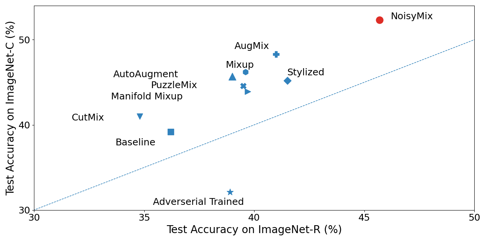

# NoisyMix: Boosting Model Robustness and In-domain Accuracy

NoisyMix is a training scheme that combines data augmentations with stability training and noise injections. Models trained with NoisyMix generalize better and show to be more robustnes to common currptions. Compared the other data augementation schemes, the advantage is substantial when models are evlauated on ImageNet-C, and ImageNet-R as shown by the following figure.

<p align="center">
    
</p>


If you would like to use our code, you can simply train a ResNet-18 with NoisyMix on CIFAR-100 as follows.


```
export CUDA_VISIBLE_DEVICES=0; python3 cifar.py --arch preactresnet18 --augmix 1 --jsd 1 --alpha 1.0 --manifold_mixup 1 --add_noise_level 0.5 --mult_noise_level 0.5 --sparse_level 0.65 --seed 1
```

You can also simply train a Wide-ResNet-28x2 with NoisyMix on CIFAR-100 as follows.

```
export CUDA_VISIBLE_DEVICES=0; python3 cifar.py --arch wideresnet28 --augmix 1 --jsd 1 --alpha 1.0 --manifold_mixup 1 --add_noise_level 0.5 --mult_noise_level 0.5 --sparse_level 0.65 --seed 1
```


For more details, please refer to the [paper](). If you find this work useful and use it on your own research, please concider citing our paper.   Please, also consider to cite Noisy Feature Mixup [paper](https://arxiv.org/abs/2110.02180) and AugMix [paper](https://arxiv.org/abs/1912.02781), since our NoisyMix scheme leverages ideas such as data augmentations with stability training and noise injections.

